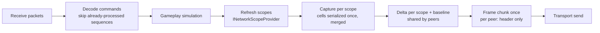
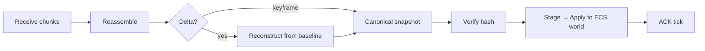
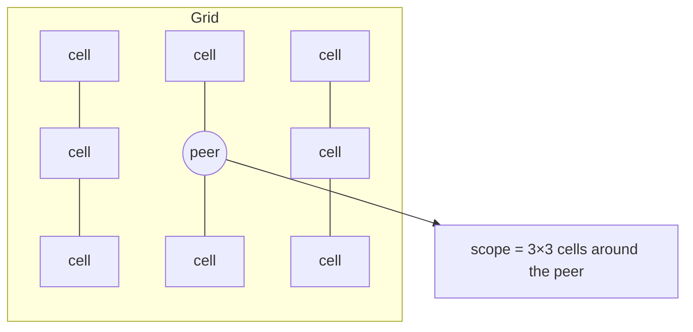

# Static ECS Network

Transport-neutral protocol and replication for Static ECS: server-authoritative snapshots,
client commands, deltas, recovery. Protocol **v10**.

## Server tick



- **Capture:** one canonical snapshot per scope per tick, sorted by entity GID.
- **Delta:** encoded against the tick each peer acknowledged. Peers with the same scope and
  baseline share the same delta and framed chunk; only the packet header is per peer.
- **Keyframe:** sent when a peer has no usable baseline, requested a resync, or changed scope.

## Client



- The ACK advances only after a successful apply; that tick becomes the next baseline.
- A failed apply requests recovery; a bad delta requests a keyframe.
- A delta from a previous scope that is still in flight after a scope change is dropped as
  `ScopeStale`: no error, no recovery.

## Delta wire format

| Operation | Encodes |
|---|---|
| `Remove` | Position in the baseline (varint skip) |
| `Add` | Full entity bytes |
| `PatchFast` | Skip + 2-bit mask per record (changed, disabled) + changed payloads |
| `PatchFull` | Records added or removed on an entity |

- Unchanged entities and records cost 0 bytes.
- Components implementing `INetworkComponentDelta` send a value delta against the baseline
  record instead of the raw payload (for example position XOR, changed animation fields).
- A moving entity costs about 10 bytes (it was 44 in v7).
- The Burst backend plans the delta structure; managed code writes every byte. Output is
  byte-identical to the portable encoder.

## Interest management



- **`INetworkScopeProvider<TWorld>`** assigns each peer a scope every tick and lists the
  scope's entities. Without a provider there is one global scope.
- **`INetworkCellularScopeProvider<TWorld>`** also exposes a scope's cells. Capture then
  serializes each cell once per tick and builds every scope by merging cell blocks.
- **Scope change:** the peer gets a keyframe of the new scope; the scope travels in the chunk
  header. All scope histories share one byte budget.
- **`INetworkUpdatePolicy<TWorld>`** can hold an entity: its previous bytes are reused, so it
  costs nothing in the delta. Owned entities and keyframes are always fresh.

## Client options

| Option | Effect | Default |
|---|---|---|
| `NetworkReplicaSkipPolicy<TWorld>` | Skip apply for entities whose bytes did not change | Off: prediction writes replicated components |
| `canonicalOnlyApply` | Accept a verified snapshot as baseline without an ECS world | Off: used by light load clients |
| `NetworkReconstructionCache` | Share delta reconstruction between clients in one process | Off: used by the load generator |

## Usage

Declare reachable roots in each composition assembly; generated schemas provide
serialization and registration:

```csharp
[assembly: NetworkEndpoint("Authority", typeof(Main), NetworkRole.Server,
    typeof(MoveInput), typeof(NetworkOwnerComponent))]

[assembly: NetworkEndpoint("Client", typeof(ClientWorld), NetworkRole.Client,
    typeof(MoveInput), typeof(NetworkOwnerComponent))]
```

Gameplay features own command cadence, server policy, simulation, prediction and
presentation; see the
[network feature development guide](../../../docs/guides/network-feature-development.md).

## Contract

- Both endpoints must match the protocol version and the schema, simulation and content fingerprints.
- Tick commands are unreliable with redundancy; transactions and snapshots are reliable.
- Command batches obey `MaxUnreliablePayloadBytes`; snapshot chunks obey `MaxReliablePayloadBytes`.
- Every buffer lease is consumed, transferred or disposed on every path. A received lease
  caches its decode result, so a packet is hashed once.
- Compression, authentication, encryption and server rewind are out of scope.
- Architecture: [network-static-ecs.md](../../../docs/guides/network-static-ecs.md).
